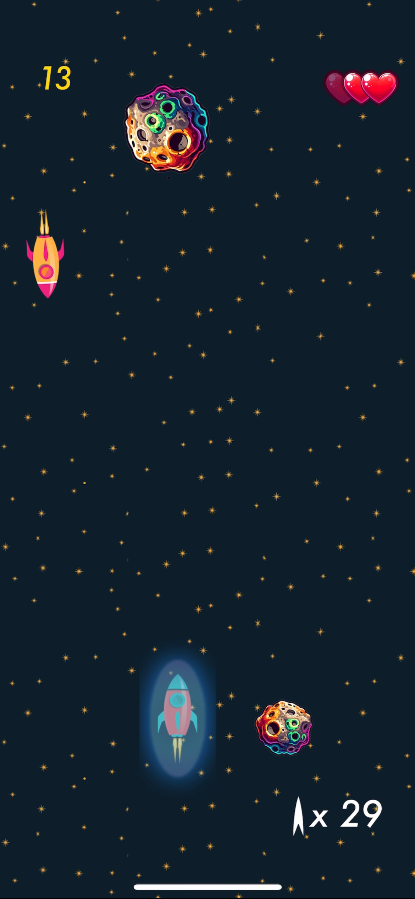

# Solo Mission

**Solo Mission** is an exciting 2D space shooter game developed using Swift and SpriteKit, designed to test your reflexes and strategic skills. As the player, you control a spaceship located at the bottom of the screen, tasked with defending against waves of enemy ships descending from above. Your objective is to shoot down the enemies before they collide with your ship or pass through your defenses. Survival is key—how long can you last in the vastness of space?

## Features

- **Intuitive Controls**: Easily maneuver your spaceship using touch controls.
- **Challenging Gameplay**: Face increasingly difficult waves of enemy ships.
- **Score Tracking**: Keep track of your high scores and strive to beat them.
- **Immersive Graphics and Sound**: Enjoy a visually engaging experience with dynamic sound effects.

## Getting Started

1. **Clone the Repository**:
   ```sh
   git clone https://github.com/Nikoloz2cs/solo-mission.git
   ```
   Or otherwise obtain a copy from the repo.
2. **Open in Xcode**:
   - Open `Solo Mission.xcodeproj` in Xcode.
3. **Build and Run**:
   - Select your target device or simulator.
   - Click the `Run` button or press `Command + R`.

## Gameplay

<table>
  <tr>
    <td>
      <a href="https://github.com/Nikoloz2cs/Solo-Mission/raw/main/Solo_Mission_Gameplay.mov">
        
      </a>
    </td>
    <td>
      <p>Download the gameplay file from this repo to watch a short gameplay video.</p>
       <p> The image/preview are from version 1 (Click image to download preview) </p>
      <h2>How to Play</h2>
      <ul>
        <li><strong>Move Your Ship:</strong> Use touch controls to navigate your ship left and right.</li>
        <li><strong>Shoot:</strong> Tap the screen to fire at incoming enemies.</li>
        <li><strong>Avoid Collisions:</strong> Don't let enemy ships collide with your ship.</li>
        <li><strong>Destroy Enemies:</strong> Shoot down enemy ships before they pass through your defenses.</li>
      </ul>
      <p>Happy gaming! 🚀</p>
    </td>
  </tr>
</table>

## Credits
The first couple commits of this project was made following the youtube series guide from [Matt Heaney Apps](https://www.youtube.com/@MattHeaneyApps). 
The first couple commits of this project has differences from said guide including but not limited to correct/modernized parts of code, 
modifications to sizing considering new iPhone releases and different sound effects/songs. All assets used in the app seen in the first
couple commits are open-source/royalty free, feel free to copy them. 
